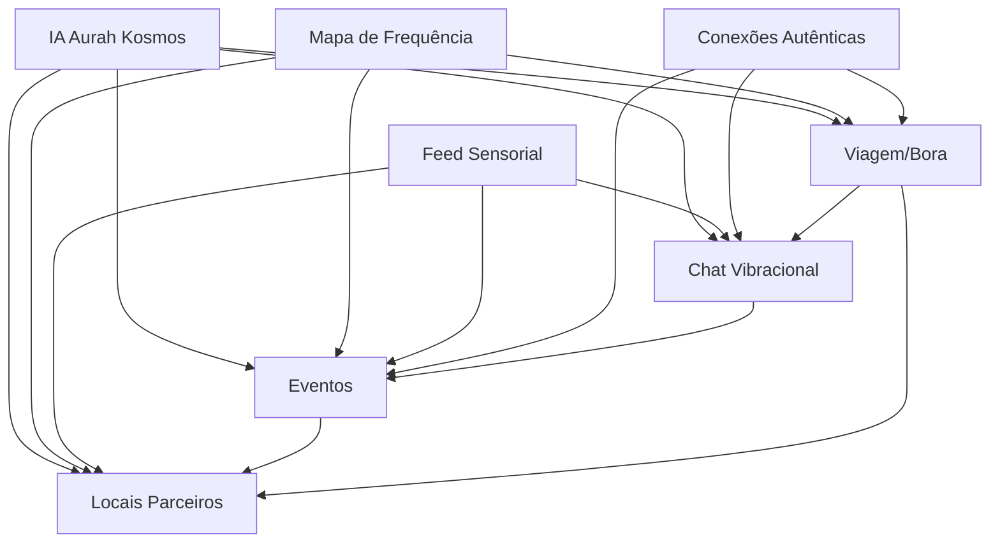

# Índice Geral da Documentação - FriendApp Core

**Última Atualização:** 17/10/2025  
**Versão:** 2.0  
**Total de Módulos:** 11

---

## 📚 Estrutura da Documentação

```
friendapp-core/
├── docs/
│   ├── INDICE.md (este arquivo)
│   ├── sumario-executivo.md (visão geral dos 7 módulos core)
│   ├── arquitetura-modulos-integrados.md (arquitetura dos 4 novos módulos)
│   ├── roadmap-integracao-modulos.md (planejamento de implementação)
│   ├── relatorio-integracao-tecnica.md (validação e consistência)
│   └── resumos/
│       ├── [Core] Sistema de Cadastro Consciente
│       ├── [Core] Teste de Personalidade Energética
│       ├── [Core] IA Aurah Kosmos (76 Camadas)
│       ├── [Core] Feed Sensorial
│       ├── [Core] Sistema de Conexões Autênticas
│       ├── [Core] Jogo da Transmutação
│       ├── [Core] Mapa de Frequência
│       ├── [Novo] Sistema de Chat Vibracional ⭐
│       ├── [Novo] Sistema de Eventos e Experiências ⭐
│       ├── [Novo] Sistema de Locais Parceiros B2B ⭐
│       └── [Novo] Sistema de Conexões Reais (Viagem + Bora) ⭐
└── manuais/
    └── manuais/ (11 PDFs técnicos originais)
```

---

## 🎯 Documentos Principais

### 1. Visão Geral e Estratégia

| Documento | Descrição | Páginas | Última Atualização |
|-----------|-----------|---------|-------------------|
| [Sumário Executivo](./sumario-executivo.md) | Visão completa do ecossistema FriendApp (módulos core 1-7) | 613 linhas | 17/10/2025 |
| [Arquitetura de Módulos Integrados](./arquitetura-modulos-integrados.md) | Arquitetura técnica dos 4 novos módulos | 427 linhas | 17/10/2025 |
| [Roadmap de Integração](./roadmap-integracao-modulos.md) | Planejamento de 12 meses para implementação | 513 linhas | 17/10/2025 |
| [Relatório de Integração Técnica](./relatorio-integracao-tecnica.md) | Validação de consistência e próximos passos | Novo | 17/10/2025 |

### 2. Resumos Técnicos por Módulo

#### Módulos Core (Já Implementados)

| # | Módulo | Arquivo | Linhas | Status |
|---|--------|---------|--------|--------|
| 1 | Sistema de Cadastro Consciente | [sistema-cadastro.md](./resumos/sistema-cadastro.md) | 311 | ✅ Ativo |
| 2 | Teste de Personalidade Energética | [teste-personalidade-energetica.md](./resumos/teste-personalidade-energetica.md) | 193 | ✅ Ativo |
| 3 | IA Aurah Kosmos (76 Camadas) | [ia-aurah-kosmos.md](./resumos/ia-aurah-kosmos.md) | 348 | ✅ Ativo |
| 4 | Feed Sensorial | [feed-sensorial.md](./resumos/feed-sensorial.md) | 307 | ✅ Ativo |
| 5 | Sistema de Conexões Autênticas | [sistema-conexoes-autenticas.md](./resumos/sistema-conexoes-autenticas.md) | 396 | ✅ Ativo |
| 6 | Jogo da Transmutação | [jogo-transmutacao.md](./resumos/jogo-transmutacao.md) | 204 | ✅ Ativo |
| 7 | Mapa de Frequência | [mapa-frequencia.md](./resumos/mapa-frequencia.md) | 294 | ✅ Ativo |

#### Novos Módulos (Recém Integrados)

| # | Módulo | Arquivo | Linhas | Status |
|---|--------|---------|--------|--------|
| 8 | Sistema de Chat e Mensagens Vibracionais | [sistema-chat-vibracional.md](./resumos/sistema-chat-vibracional.md) | 376 | ⭐ MVP Próximo |
| 9 | Sistema de Eventos, Encontros e Experiências | [sistema-eventos-experiencias.md](./resumos/sistema-eventos-experiencias.md) | 524 | ⭐ Planejado |
| 10 | Sistema de Locais Parceiros e Experiências Comerciais | [sistema-locais-parceiros.md](./resumos/sistema-locais-parceiros.md) | 561 | ⭐ Planejado |
| 11 | Sistema de Conexões Reais (Modo Viagem + Bora) | [sistema-conexoes-reais.md](./resumos/sistema-conexoes-reais.md) | 625 | ⭐ Planejado |

---

## 🔗 Mapa de Integrações entre Módulos

### Integrações Diretas Validadas



### Pontos de Integração por Módulo

#### Chat Vibracional (8 integrações)
- ← IA Aurah: Análise de metadados e reciprocidade
- ← Feed: Posts podem iniciar chats
- ← Conexões: Conexões autênticas podem abrir chat
- → Eventos: Check-ins simultâneos ativam chat
- → Bora: Grupos criam chats automáticos
- ← Cadastro: Verificação de identidade
- ← Personalidade: Compatibilidade inicial
- ← Mapa: Atividade de chat aparece no mapa

#### Eventos (10 integrações)
- ← IA Aurah: Curadoria automática
- ← Mapa: Eventos aparecem como hotspots
- ← Feed: Posts sobre eventos
- → Chat: Check-ins ativam conversas
- ← Conexões: Eventos fortalecem conexões
- → Locais: Eventos ocorrem em locais parceiros
- ← Viagem: Sugestões para viajantes
- ← Jogo: Missões de eventos
- ← Cadastro: Permissões de criação
- ← Personalidade: Recomendações personalizadas

#### Locais Parceiros (9 integrações)
- ← IA Aurah: Cálculo de score vibracional
- ← Mapa: Locais com estados visuais
- → Feed: Check-ins geram posts
- ← Eventos: Hospedam eventos
- ← Bora: Grupos escolhem locais
- ← Jogo: Missões de harmonização
- ← Conexões: Fortalecem vínculos
- ← Cadastro: Onboarding B2B
- ← Viagem: Locais sugeridos para viajantes

#### Viagem + Bora (11 integrações)
- ← IA Aurah: Colisões preditivas e moderação
- ← Mapa: Projeções energéticas visualizadas
- → Chat: Colisões geram conversas
- → Eventos: Sugestões de eventos locais
- → Locais: Recomendações de locais
- ← Conexões: Colisões geram conexões
- ← Feed: Experiências viram memórias
- ← Jogo: Missões de viagem/grupo
- ← Cadastro: Verificação de identidade
- ← Personalidade: Compatibilidade de grupo
- → Bora: Modo Viagem complementa Bora

**Total:** 38 pontos de integração mapeados

---

## 🛠️ Stack Tecnológico Unificado

### Backend

| Tecnologia | Módulos | Função |
|------------|---------|--------|
| **Node.js** | Todos | APIs REST principais |
| **Python** | IA Aurah, ML | Processamento de IA e aprendizado |
| **Go** | Chat, Locais, Eventos | WebSocket, geolocalização, alta performance |
| **PostgreSQL** | Todos | Banco de dados relacional principal |
| **Firestore** | Chat, Feed, Mapa | Dados em tempo real |
| **Neo4j** | Conexões, Viagem | Grafos relacionais |
| **Redis** | Todos | Cache e estados temporários |
| **ElasticSearch** | Feed, Eventos, Locais, Viagem | Busca e indexação |
| **Kafka/PubSub** | Novos módulos | Mensageria assíncrona |

### Frontend

| Tecnologia | Uso |
|------------|-----|
| **Flutter** | iOS, Android, Web (PWA) |
| **Provider/Riverpod** | State management |
| **Socket.IO** | Real-time (Chat, Notificações) |
| **Mapbox/Google Maps** | Mapa de Frequência |
| **WebGL** | Efeitos sensoriais (Feed, Teste) |

### Infraestrutura

| Componente | Uso |
|------------|-----|
| **Docker** | Containerização |
| **Kubernetes (GKE/EKS)** | Orquestração e auto-scaling |
| **AWS/GCP** | Multi-cloud |
| **CloudFront/CDN** | Distribuição de mídia |
| **Prometheus + Grafana** | Observabilidade |
| **Sentry** | Error tracking |
| **DataDog** | APM e logs |

---

## 📊 Timeline de Implementação

### Fase Atual: Documentação Concluída ✅
- ✅ 11 módulos documentados
- ✅ Arquitetura consolidada
- ✅ Integrações mapeadas
- ✅ Roadmap definido

### Próximas Fases

| Fase | Período | Módulo | Status |
|------|---------|--------|--------|
| **Fase 1** | Mês 1-2 | Chat Vibracional MVP | 🔴 Próxima |
| **Fase 2** | Mês 3-4 | Eventos MVP + Integração Chat | 🟡 Planejado |
| **Fase 3** | Mês 5-7 | Locais Parceiros B2B | 🟡 Planejado |
| **Fase 4** | Mês 8-10 | Modo Viagem + Modo Bora | 🟡 Planejado |
| **Fase 5** | Mês 11-12 | Otimizações & Features Avançadas | 🟢 Planejado |

---

## 📖 Como Usar Este Índice

### Para Desenvolvedores
1. **Começando:** Leia o [Sumário Executivo](./sumario-executivo.md) para entender a visão geral
2. **Arquitetura:** Consulte [Arquitetura de Módulos Integrados](./arquitetura-modulos-integrados.md)
3. **Implementação:** Siga o [Roadmap de Integração](./roadmap-integracao-modulos.md)
4. **Detalhes Técnicos:** Acesse os resumos individuais em `docs/resumos/`

### Para Product Managers
1. **Visão Estratégica:** [Sumário Executivo](./sumario-executivo.md)
2. **Planejamento:** [Roadmap de Integração](./roadmap-integracao-modulos.md)
3. **Status:** [Relatório de Integração Técnica](./relatorio-integracao-tecnica.md)

### Para Designers
1. **Experiência do Usuário:** Leia os fluxos em cada resumo técnico
2. **Componentes Visuais:** Consulte seções de UI/UX em cada módulo
3. **Integrações:** Use o mapa de integrações acima para entender conexões

### Para Stakeholders
1. **Visão Geral:** [Sumário Executivo](./sumario-executivo.md)
2. **Timeline:** Seção "Timeline de Implementação" neste documento
3. **Riscos e Mitigações:** [Relatório de Integração Técnica](./relatorio-integracao-tecnica.md)

---

## 🔍 Índice Temático

### Por Tema Técnico

#### Inteligência Artificial
- [IA Aurah Kosmos](./resumos/ia-aurah-kosmos.md) (módulo central)
- [Teste de Personalidade](./resumos/teste-personalidade-energetica.md) (ML/NLP)
- [Feed Sensorial](./resumos/feed-sensorial.md) (vetorização)
- [Chat Vibracional](./resumos/sistema-chat-vibracional.md) (análise de metadados)
- [Eventos](./resumos/sistema-eventos-experiencias.md) (curadoria)
- [Locais Parceiros](./resumos/sistema-locais-parceiros.md) (score vibracional)
- [Viagem/Bora](./resumos/sistema-conexoes-reais.md) (colisões preditivas)

#### Tempo Real & WebSocket
- [Chat Vibracional](./resumos/sistema-chat-vibracional.md) (E2EE + WebSocket)
- [Mapa de Frequência](./resumos/mapa-frequencia.md) (geolocalização real-time)
- [Eventos](./resumos/sistema-eventos-experiencias.md) (check-ins)

#### Gamificação
- [Jogo da Transmutação](./resumos/jogo-transmutacao.md) (sistema principal)
- Todos os módulos (missões específicas)

#### B2B & Monetização
- [Locais Parceiros](./resumos/sistema-locais-parceiros.md) (tiers de assinatura)
- [Eventos](./resumos/sistema-eventos-experiencias.md) (eventos pagos)

#### Segurança & Compliance
- [Cadastro Consciente](./resumos/sistema-cadastro.md) (verificação documental)
- [Chat Vibracional](./resumos/sistema-chat-vibracional.md) (E2EE)
- [Viagem/Bora](./resumos/sistema-conexoes-reais.md) (Aurah Guardian)

#### Geolocalização
- [Mapa de Frequência](./resumos/mapa-frequencia.md)
- [Locais Parceiros](./resumos/sistema-locais-parceiros.md)
- [Eventos](./resumos/sistema-eventos-experiencias.md)
- [Viagem/Bora](./resumos/sistema-conexoes-reais.md)

---

## 📞 Referências Rápidas

### Métricas-Chave de Sucesso

| Módulo | Métrica Principal | Target |
|--------|------------------|--------|
| Cadastro | Taxa de conclusão | > 80% |
| Personalidade | Tempo médio | 3-5 min |
| Feed | Tempo de sessão | > 8 min |
| Conexões | Taxa de aceite | > 70% |
| Chat | Latência | < 100ms |
| Eventos | Taxa de check-in | > 70% |
| Locais | Score atualização | < 15 min |
| Viagem/Bora | Precisão colisão | > 75% |

### Equipes Responsáveis

| Squad | Módulos | Tamanho |
|-------|---------|---------|
| **Core Platform** | Cadastro, IA Aurah, Personalidade | 6 pessoas |
| **Social Experience** | Feed, Conexões, Jogo | 5 pessoas |
| **Real-Time** | Chat, Mapa | 5 pessoas |
| **Events & Places** | Eventos, Locais | 4 pessoas |
| **Discovery** | Viagem, Bora | 4 pessoas |
| **Data & ML** | IA, Vetores, Analytics | 4 pessoas |
| **DevOps & Infra** | Kubernetes, Databases, CI/CD | 3 pessoas |

**Total:** ~31 pessoas distribuídas em 7 squads

---

## 🆘 Suporte e Contatos

### Documentação
- **Issues:** [GitHub Issues](https://github.com/thayssagomesoficial-lang/friendapp-core/issues)
- **Wiki:** Em construção
- **API Docs:** Em construção (OpenAPI/Swagger)

### Comunicação
- **Slack:** #friendapp-core (canal principal)
- **Daily Standup:** 9h30 (online)
- **Sprint Review:** Quintas-feiras, 16h

---

**Índice Mantido por:** Tech Lead + Product Owner  
**Última Revisão:** 17/10/2025  
**Próxima Revisão:** Após cada release major  
**Versão:** 2.0
